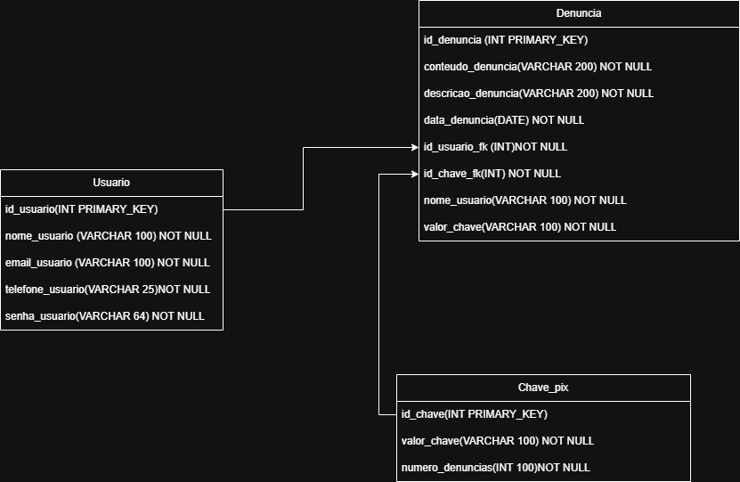

# PIX SHIELD
>Pix Shield é uma plataforma online e gratuita que funciona como central de reclamação de chaves pix com suspeitas de fraude. Nela o usuário pode pesquisar chaves pix, registrar denúncias e ter acesso a estatísticas sobre as mesmas.

### Membros:
* **Gabriel Moraes Martins** ([GitHub](https://github.com/Gdriz20) / [LinkedIn](link))
* **Kleber Tadeu Gobitozzi Filho** ([GitHub](https://github.com/K-Tadeu) / [LinkedIn](https://www.linkedin.com/in/kleber-tadeu))
* **Leonardo do Amaral Quinquio** ([GitHub](https://github.com/leonarddoamaral) / [LinkedIn](https://www.linkedin.com/in/leonardoquinquio))
* **Luighi Cordeiro Gaspareto** ([GitHub](https://github.com/LuighiCordeiro) / [LinkedIn](https://www.linkedin.com/in/luighi-cordeiro-gaspareto-845a9a258))

## Tecnologias Utilizadas

* **Back-end/API:** JavaScript
* **Front-end:** React com TypeScript
* **Banco de Dados:** SQL

## Link para repositórios

[Front-End](https://github.com/leonarddoamaral/pixshield_frontend)

[Micro serviço Denúncia](https://github.com/K-Tadeu/pixshield_backend_denuncias)

[Micro serviço Usuário](https://github.com/K-Tadeu/pixshield_backend_usuario)

[Micro serviço Chave Pix](https://github.com/K-Tadeu/pixshield_backend_chavepix)

## Cronograma e Entregas
 

### Front-end 🖼️🎨

| Data | Tarefa |
| :--- | :--- |
| **🗓️ 29/10** | Início das telas no Figma (Mínimo 3 telas). ✔|
| **🗓️ 05/11** | Todas as telas prontas no Figma + Diagrama de Navegação (Pode ser feito no Draw.io). ✔|
| **🗓️ 12/11** | 80% das telas prontas em REACT.✔ |
| **🗓️ 19/11** | Projeto finalizado com integração com back-end. ✔|

---

### Back-end 📊📟

| Data | Tarefa |
| :--- | :--- |
| **🗓️ 29/10** | Requisitos (RF e RNF), Diagrama de Classes e Diagrama do Banco de Dados. ✔|
| **🗓️ 05/11** | Criação do banco de dados e início do back-end. ✔|
| **🗓️ 12/11** | 80% do back-end finalizado.✔|
| **🗓️ 19/11** | Projeto finalizado com integração com front-end. ✔|

-----

## Documentação 

### Requisitos Funcionais (RFs)

| RF | Requisitos Funcionais |
|:--- | :--- |
| **RF01** |	O Sistema deve permitir cadastro de novos usuarios. |
| **RF02** |	O Sistema deve permitir ao usuario criar mais de uma denuncia. |
| **RF03** |	O sistema deve permitir a consulta de uma chave PIX por qualquer usuário, sem necessidade de login. |
| **RF04** |	O Sistema deve permitir somente a criação de uma denuncia se o usuario tiver um cadastro. |
| **RF05** |  O usuário deve ter acesso a um histórico com todas as denúncias que registrou. |

### Requisitos Não funcionais (RNFs)

| RNF | Requisitos Não funcionais |
|:--- | :--- |
| **RNF01** | O código deve utilizar as linguagens JavaScript para o back-end, TypeScritpt(utilizando a biblioteca React) para o front-end e SQL para o banco de dados |
| **RNF02** |O sistema deve seguir as heurísticas de Nielsen para garantir uma boa experiência e interface de usuário. |
| **RNF03** | Cada microserviço deve ser isolado e independente. |
| **RNF04** | O Frontend deve fornecer uma interface de usuário clara e responsiva para acesso em dispositivos móveis. |

## Arquitetura e Design

### Diagrama do Banco de Dados

[Visualizar o Diagrama do Banco de Dados na pasta](Docs/Diagramas/DiagramaDataBase.png)

[Visualizar o Diagrama do Banco de Dados Interativo (diagrams.net)](https://viewer.diagrams.net/?tags=%7B%7D&lightbox=1&highlight=0000ff&edit=_blank&layers=1&nav=1&title=Diagrama%20db%20Pix%20Shield.drawio&dark=auto#R%3Cmxfile%3E%3Cdiagram%20name%3D%22Page-1%22%20id%3D%22W171z0s9dX535PrIy8kR%22%3E7ZpZc6M4EIB%2FjatmHryFwTj2o49M5nCOtZ1Nsi8pDcigtUCOED7m12%2BDhAFDEmcnNtkqUq4KalpCdH9I3Q0NY%2BhtLjhaupfMxrSha%2FamYYwaOvwZLfgXSbZSctbrSoHDiS1FrVQwJb%2BwEmpKGhIbBzlFwRgVZJkXWsz3sSVyMsQ5W%2BfV5ozmr7pEDi4IphaiRekdsYUrpV1TS%2BVfMXHc5MotTZ3xUKKsBIGLbLbOiIzzhjHkjAl55G2GmEbGS%2Bwi%2B3155uxuYhz74pAOZ5aPmNlZfQ9bA2fzMOX0R6%2BpRlkhGqobvg1CxAlTcxbbxBDBmngU%2BdAazJkvpuqMBm3LJdQeoy0Lo4kEAlmLpDVwGSe%2FQB9RONUCAZzmQvnZ0HIa06inGpPjAHRukrtr7Yku0SanOEaBSGbDKEXLgPyM5xd19BB3iD9gQjBPKa1dIvB0iaxIZw3oRhMRXjLJom0TQ2Eu8CYjUra%2BwMzDgm9BRZ1tJn5X4Osd1V6nGOkJRm4Woa4SIoWusxs79S4cKAe%2Fwdl6wdnEfgylvz99u5rBuZvJt8v%2B5OHxx%2FnD5wICcOci9iBnCzxklHGQ%2B0wyQSjdEyFKHB%2BaFM%2BjbpHpCDxYfSX2iG1HIw8CcAPxnXGsNmqnkokySiRi0H1O4%2BfHhY4YRhgsGfFFbCRzAD8w21D7w2yYMNchtFtpG36ROhdD5sP0EYndigGaNY7AGXAmkEA%2Fd0i%2FmY8Xn67XoVGQGAcyYhwLEaOAiA8jJ5A09A4V0j9%2BDo3OUxgtY9JszUDarR%2BZiOPYXIkCHDnqf0M3evKISskXOaxU%2BPRXfzL82p%2FAGLCkAova1XUE6NXteFyDeXIwD128jgZmuwAm9hChKZlaTcyHIqZ3QmL4ZDVf3C9C7Bl9raOHzebZtCS0ERj8Bw7d7XkpMbr5uaalQlpa%2BglxGXWsv2edh%2FD2O3KXT5jcMWSX4BJg30UlrHTa9eJSNS5m1ftRt4DLCPuhbxFUZ06%2FmTm1zXzmdFb0tdEp8fVO8d2d3StLnOydv7U6eTrCotA9mJvnk6dSTo62JujFBNuCxxOHNtvRko056ii1cmZK8pqjMcPHi9WfeqvzdNHFt%2B2b1TWZbUrCDhsHFge%2F1cy8CzMFFg7F6C2ZzdGYGV7feaE7WczmTytDW3fN5aRZUsezwS4pLqP%2B7LympOKVpSyjOfF2VKyZpPXex%2FlCBS65xPdk9b2ayNMTWZI0nZbIVjFrAiItF60w8BjDWC9bFUPSrToiKu5u2VcQdZX3Q8VCu%2Ff0leFSfGMFh4zLVaWm5WPR0q58B9ILbse2g5OaHJjQZQ7zET1PpWC90LexrWyX6owZWyqL%2FYOF2KraHAoFy9sTb4i4zxw%2FREOB62RrlBTk4sY2afhwv%2FfZRqZX1Ey7xa2kX9FRyncBC7mFX4oXpZ5A3MEv%2BTiJKyPDvbilcEyRICucm0aZS1XXmwj4TB1w7wsKo71HhZyp6pWC0eccbTNq6jl69jrG%2FnU0Mzvcq%2Fq6Ye5xKWeQUrqzyW%2BAW1znhnHctCSbAtJ1xfmNFWfdzHm0XZbiGyXr1C7Je%2F%2BFqjR5k5taXW0%2Bwiso42BoXig3lzFyvL3MrEOf%2Fw8uZZXmY%2BFS%2Bj1ESV4VepinZeZALSwRLjUrVbJy6PZzvKWlV2WYnMTCh4TJ%2Fz3cTXbYV%2BPdpGr1fvHuM76BZvo5uAwc04%2FqjfN%2FAQ%3D%3D%3C%2Fdiagram%3E%3C%2Fmxfile%3E)

### Diagrama De Navegação

[Vizualizar diagrama de navegacão na pasta](/Docs/Diagramas/diagramaNavegação.png)

### Esboço de Layout Telas (Apenas Design)

[Visualizar pasta com Layouts](Docs/Layouts/)

